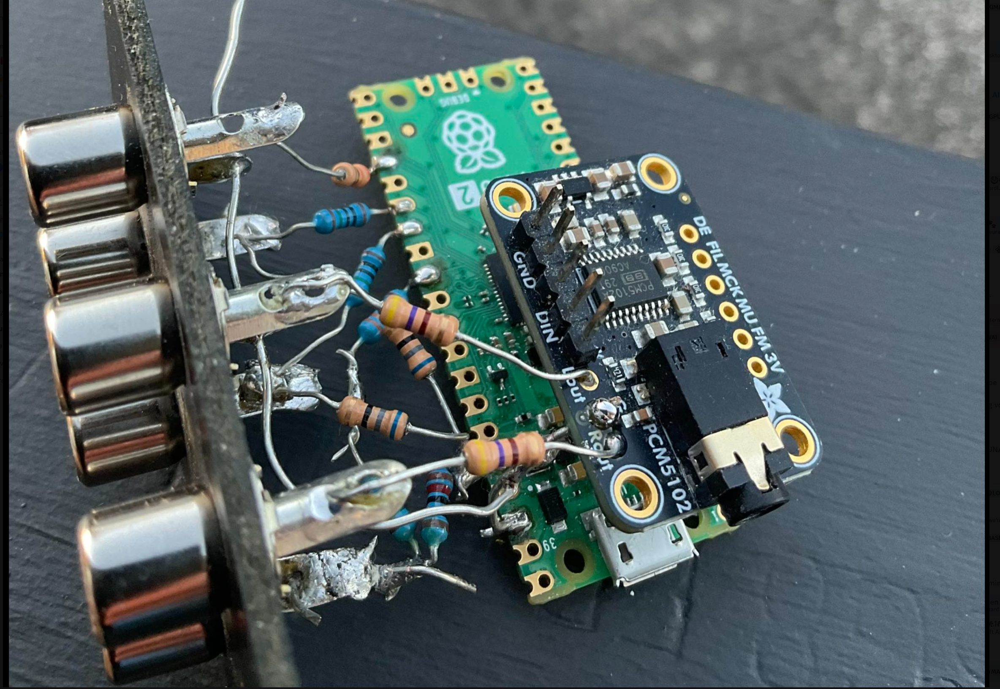
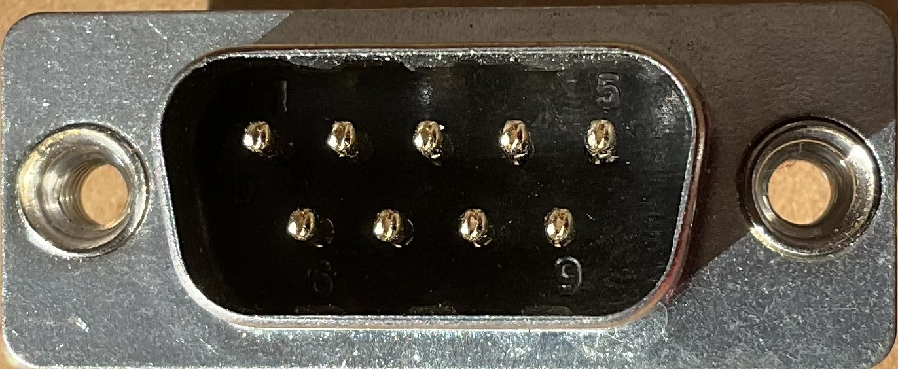

[](https://opensource.org/licenses/MIT) 
[](https://deno.land/)
[](https://discord.gg/xkSVNT2xYR)

 

# nitrologic microPAL VidBit 0.0.6 🤖

An RP2350 microcontroller video game harness.

## documentation

https://github.com/nitrologic/vidbit

# CONNECTORS

# PS/2 Mini DIN 6
```
   ◎   ◎
  ◎     ◎
    ◎ ◎

6 4 2  1 3 5
```

| pin | name |
| --- | ----------- |
| 1   | +Data
| 2   | rx0
| 3   | GND
| 4   | VCC
| 5   | +Clock
| 6   | tx0

# ATARI 9 PIN
```
 ◎ ◎ ◎ ◎ ◎
  ◎ ◎ ◎ ◎

  1 2 3 4 5
   6 7 8 9
```

| pin | name |
| --- | ----------- |
| 1   | Up
| 2   | Down
| 3   | 
| 4   | 
| 5   | Paddle B
| 6   | Paddle A
| 7   | VCC
| 8   | GND
| 9   | Button

# pics

 


# codeblocks

```
"rect":"▪▫■□▢▣",
"hatched":"▤▥▦▧▨▩",
"pointChars":"◯⊙⊚⦾⦿◉◎◍❂○●◦◌",
"starChars":"✩✪✫✬✭✮✯✰✱✲✳✴✵✶✷✸✹✺✻✼✽✾✿❀❁",
"circles":"◐◒◑◓◔◕",
"markdown":"↩↪↗↘↖↙◀▶✳✴",
"square":"🔳🔲✅❎",
```
